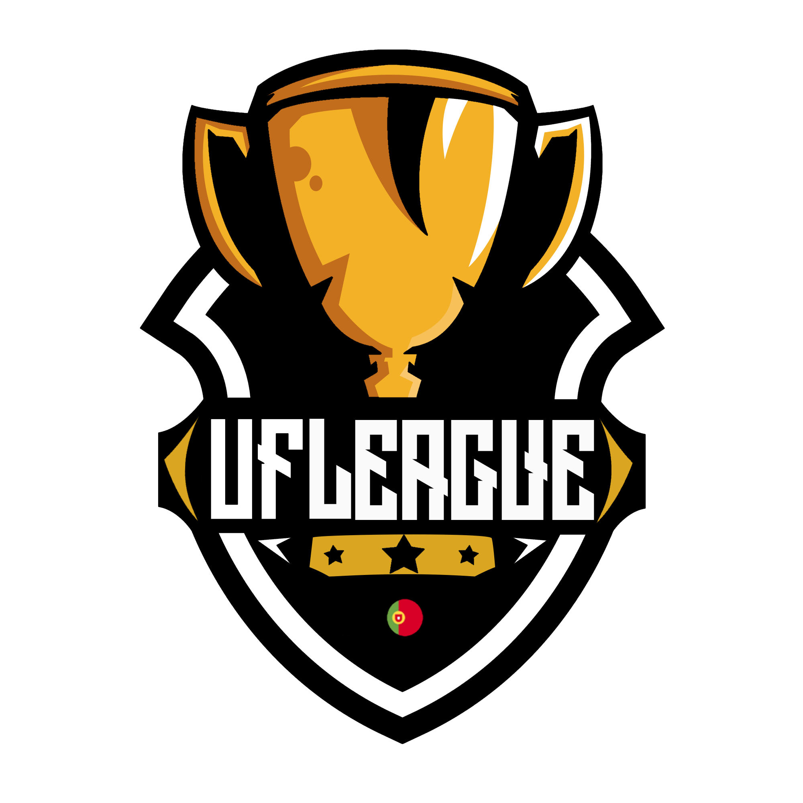

# ufleague-portugal-season 6
Official VRS documentation and materials for UF League Portugal – Season 6

  

<h1 align="center">UF League Portugal - Season 6</h1>

  <b>Counter-Strike 2 • Valve Regional Standings (VRS) Eligible</b> 
  <b>Online Qualifiers → Final Four LAN at EXSAD Gaming Lounge, Barcelos (Portugal)</b>

  
  
  
  

---

## 📝 About

**UF League Portugal – Season 6** is a Counter-Strike 2 tournament organized in Portugal and designed to be eligible for **Valve Regional Standings (VRS)**.

- 🕹️ **Game:** Counter-Strike 2  
- 🌍 **Region:** Europe (Portugal)  
- 🏟️ **LAN Finals:** EXSAD Gaming Lounge, Barcelos  
- 🎯 **Format:** 2x Open Qualifiers → Final Four LAN  
- 🎓 **Objective:** Provide a structured, integrity-focused path for teams to earn VRS points and compete on LAN.

---

## 📂 Documents

All core documents for Valve, teams and partners are available in this repository:

- 📘 **[RULEBOOK.md](RULEBOOK.md)** – Complete tournament rulebook  
- 🗓️ **[SCHEDULE.md](SCHEDULE.md)** – Dates & format (Qualifiers + LAN)  
- 🧾 **[VALVE.md](VALVE.md)** – Valve Specific Information (VRS application data)

---

## 🏆 Tournament Structure

### Online Open Qualifiers
- 2x Open Qualifiers (online)  
- Platform: FACEIT or equivalent (TBA)  
- BO1 in early rounds  
- BO3 from Quarterfinals onward  
- Top 2 teams from each qualifier → qualify for LAN (4 teams total)

### LAN Finals – EXSAD Gaming Lounge (Barcelos, Portugal)
- 4 qualified teams  
- Single Elimination Bracket  
- Semifinals – BO3  
- Grand Final – BO3 or BO5 (TBA)  

Full competitive details and game rules are defined in **RULEBOOK.md**.

---

## 🎥 Broadcast & Production

The event will be produced and broadcast by **UF League Portugal** with:

- Professional CS2 observing  
- Custom HUD with GSI integration (real-time stats)  
- Full overlay package with sponsor integration  

Official broadcast channels (Twitch / YouTube) will be announced closer to the event start.

---

## 🤝 Partners & Sponsorship

UF League Portugal is open to sponsorships and partnerships for:

- Prize pool support  
- Hardware / skins / product activation  
- Broadcast segments & branded content  

If you are interested in partnering with **UF League Portugal – VRS Season 1**, please reach out via email.

---

## 📬 Contact

**Tournament Director / Operator**  
Fábio “Wan43r” Pereira  
📧 Email: **fabiopereira199333@gmail.com**  
📍 Location: Portugal  

---

  © 2025 UF League Portugal – All rights reserved.

